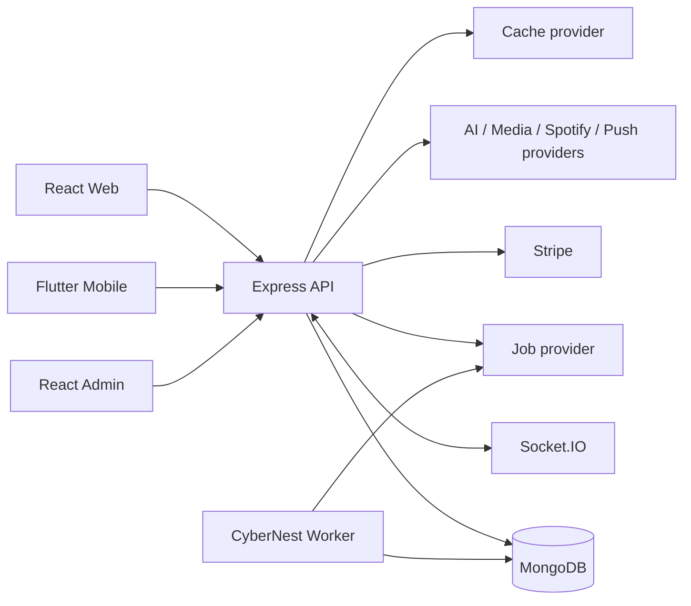

# CyberNest architecture

Provider boundaries isolate AI, calls, moderation, media, cache, recommendations and jobs. MongoDB is authoritative; cache is disposable. API instances are stateless except when memory providers are selected for development.
