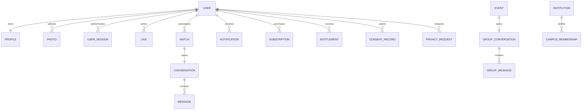

# Entity relationships

```mermaid
erDiagram
 USER ||--|| PROFILE : owns
 USER ||--o{ PHOTO : uploads
 USER ||--o{ USER_SESSION : authenticates
 USER ||--o{ LIKE : sends
 USER ||--o{ MATCH : participates
 MATCH ||--|| CONVERSATION : opens
 CONVERSATION ||--o{ MESSAGE : contains
 USER ||--o{ NOTIFICATION : receives
 USER ||--o{ SUBSCRIPTION : purchases
 USER ||--o{ ENTITLEMENT : receives
 USER ||--o{ CONSENT_RECORD : grants
 USER ||--o{ PRIVACY_REQUEST : requests
 EVENT ||--|| GROUP_CONVERSATION : opens
 GROUP_CONVERSATION ||--o{ GROUP_MESSAGE : contains
 INSTITUTION ||--o{ CAMPUS_MEMBERSHIP : verifies
```
